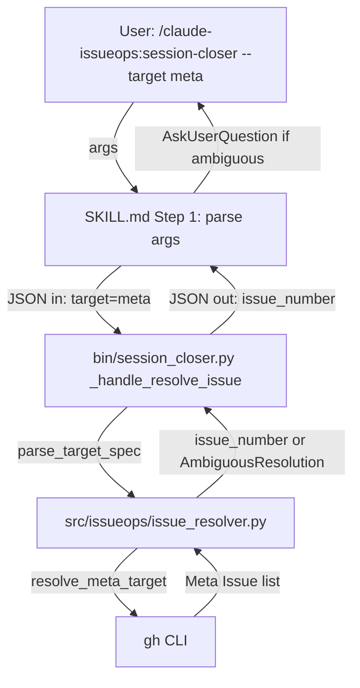
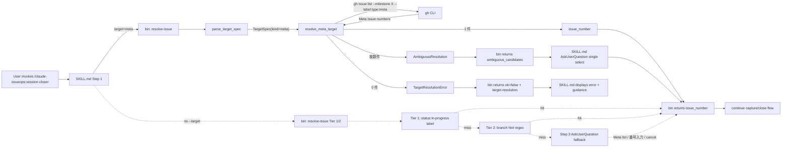

# Epic 01: target-flag

> **Status**: in-progress (initial draft、Epic [#75](https://github.com/etoyama/claude-issueops/issues/75))
>
> 本 Doc は **Living Design Doc** ([CLAUDE.md §6](../../CLAUDE.md#6-design-doc-運用-epic-living-design-doc))。Architecture / Module structure / Subcommand contract は Story 完了ごとに漸進更新する。Story timeline は append-only。

## 0. Why this Epic

- #65: cross-cutting Decision を Meta Issue に投稿する手段がない (現状の `resolve-issue` は Story / Epic 想定)
- #66: resolve-issue 全 tier 失敗時に Issue 番号を明示指定するフローがない (master ブランチ + status:in-progress なしで起動すると session-closer が何もせず終了)

両 issue を**個別フラグで解決すると spec バッティング** (`--target meta` と `--issue N` の優先順位、将来 `story:N` / `epic:N` 拡張時のフラグ乱立)。両 issue 本文の C 案 = `--target` 統合フラグで一本化する。

詳細経緯と判断は Meta [#69](https://github.com/etoyama/claude-issueops/issues/69) の design-partner セッション (Decision slugs: `adopt-target-unified-flag-for-65-66`、`dogfood-process-overhaul-pilot-on-target-flag`)。

## 1. Architecture overview (Living)



主要な責務分担:

- **SKILL.md (Step 1)**: `--target <spec>` 引数を抽出して bin に渡す。曖昧時の `AskUserQuestion` 対話を担当
- **bin adapter**: `target` payload を parse_target_spec で解釈、resolver を呼んで結果を JSON 化
- **pure module**: `TargetSpec` Value Object、`parse_target_spec`、`resolve_meta_target` (副作用なし、`list_meta_fn` を DI)

## 2. Module structure (Living)

### 新規追加 (Story 1 = #77)

```python
# src/issueops/issue_resolver.py に追加

@dataclass(frozen=True)
class TargetSpec:
    kind: Literal["meta", "issue", "story", "epic"]
    value: int | None  # meta では None、issue:N では N

class TargetResolutionError(Exception):
    """`--target meta` で 0 件など、target を解決できなかった場合に raise。

    bin handler が catch して `target-resolution` error kind に変換する。
    """

def parse_target_spec(raw: str) -> TargetSpec:
    """'meta' or '<kind>:<int>' を TargetSpec に変換。不正値は ValueError。"""
    ...

def resolve_meta_target(
    list_meta_fn: Callable[[], list[int]],
) -> int | AmbiguousResolution:
    """Meta Issue 番号を解決。

    Returns:
        - 1 件のみ: その issue_number (int)
        - 複数件: AmbiguousResolution(candidates=[...])

    Raises:
        TargetResolutionError: 0 件のとき (厳格 error、F1 設計判断)
    """
    ...
```

公開 API として `TargetSpec` Value Object、`TargetResolutionError` 例外、`parse_target_spec` / `resolve_meta_target` 関数を `__all__` に追加する。

### 拡張 (Story 2 = #76)

```python
# bin/session_closer.py _handle_resolve_issue (拡張)

def _handle_resolve_issue(payload: dict[str, Any]) -> dict[str, Any]:
    target_raw = payload.get("target")  # NEW
    if target_raw:
        return _resolve_target_spec(target_raw, payload)
    # 既存 Tier 1/2 ロジック (後方互換)
    ...
```

### 拡張 (Story 3 = #78)

- `skills/session-closer/SKILL.md` Step 1 / Step 3 の差分
- `README.md` / `README.ja.md` に Quickstart 例

## 3. Subcommand contract (Living)

`resolve-issue` subcommand の input/output 拡張。`schema_version=1` を維持 (後方互換破壊なし、`target` フィールドはオプショナル)。

### Input (拡張)

```jsonc
{
  "schema_version": 1,
  "subcommand": "resolve-issue",
  "session_id": "abc123",
  "project_dir": "/repo",
  "branch": "feat/8-session-closer-skill",  // 既存 (target 未指定時のフォールバック)
  "target": "meta"  // NEW: "meta" | "issue:N" | "story:N" | "epic:N" | (省略時は既存 Tier 1/2)
}
```

### Output (拡張)

```jsonc
// out (target で確定)
{ "schema_version": 1, "ok": true, "result": { "issue_number": 69 } }

// out (target=meta で複数件、SKILL.md の AskUserQuestion へ)
{ "schema_version": 1, "ok": true, "result": { "ambiguous_candidates": [69, 75] } }

// out (target=meta で 0 件、厳格 error)
{
  "schema_version": 1,
  "ok": false,
  "error": {
    "kind": "target-resolution",  // NEW error kind
    "message": "no open Meta issues found in the current Milestone",
    "hint": "Meta Issue を起票するか、--target なしで起動して通常 fallback を使ってください"
  }
}

// out (target syntax 不正、SKILL.md で弾くべきだが防御的に bin でも検出)
{
  "schema_version": 1,
  "ok": false,
  "error": {
    "kind": "invalid-target-spec",
    "message": "invalid target spec: 'foo' (expected 'meta' | 'issue:N')"
  }
}
```

`invalid-target-spec` は **本来 SKILL.md (Step 1) の入力バリデーションで弾く** ことが期待されるユーザー入力エラー。bin に到達した場合は防御的な fallback。`internal` (= 想定外の Python 例外) とは分離する。

### error kind 追加

| kind | 意味 | 既存 | 本 Epic で追加 |
|---|---|---|---|
| `issue-resolution` | 既存 Tier 1/2 失敗 | ✓ | — |
| `target-resolution` | `--target meta` で 0 件、または `--target story/epic` (未対応) | — | ✓ |
| `invalid-target-spec` | `--target` syntax 不正 (SKILL.md の入力バリデーションを抜けた場合の防御) | — | ✓ |

詳細は legacy [design.md](../legacy/v0.1-spec-workflow/session-closer/design.md) の "Skill ↔ bin Contract" 表に **本 Epic の差分を上書き** する形で更新する (Story 3 で finalize)。

## 4. Data flow (Living)



凡例: 実線 = `--target` 指定経路 / 点線 = `--target` 未指定経路 (既存 Tier 1/2 + #66 の解決パス)。Tier 1/2 全失敗時の AskUserQuestion fallback は `--target` 経由ではなく Step 3 で発火する。

## 5. Story timeline (Append-only)

このセクションは Story 完了ごとに append される。各エントリは「commit hash + 主要変更 + 残課題」を 3 行以内で記す。

### Story 1 (#77): pure module

- `src/issueops/issue_resolver.py` に `TargetSpec` (frozen Value Object + `__post_init__` invariant)、`TargetResolutionError`、`parse_target_spec`、`resolve_meta_target` を追加 (PR: feat/77-target-spec-pure-module)
- regex は `^(issue|story|epic):[1-9][0-9]*$` で positive int を 1 箇所に集約。bin / SKILL.md の配線は Story 2 で実施
- 残課題: bin adapter (`bin/session_closer.py` `_handle_resolve_issue`) で `target` payload を受けて新 API を呼ぶ配線、`list_meta_fn` の gh CLI 実装 (Open Question 1: label 厳格 / Open Question 2: current Milestone の取得方法)

### Story 2 (#76): bin + orchestrator wiring

- (未着手)

### Story 3 (#78): SKILL.md + docs + Living Design Doc finalize

- (未着手)

## 6. Open questions

Story 着手前に詰める必要がある論点 (Story 内の AskUserQuestion で解決):

1. **Meta Issue 判定基準** (Story 1 / Story 2 で確定):
   - 候補 a: `gh issue list --milestone <current> --label type:meta` (label 厳格)
   - 候補 b: `gh issue list --milestone <current>` の全 open issue を AskUserQuestion (label に依存しない、汎用的)
   - 候補 c: title prefix (`[Meta]` 等) で判定 (label と prefix の二重メカニズム)
   - **暫定推奨**: candidate a (label 厳格、本 repo は `type:meta` を整備済み、boatrace-insight 流派と整合)。利用者 repo にラベルがない場合の fallback 設計は別 Issue
2. **Current Milestone の取得方法** (Story 2):
   - `gh repo view --json milestones` で open milestone を抽出?
   - branch / config / 環境変数で明示?
   - **暫定推奨**: open milestone のうち最も新しい (= current phase) を採用。複数 open の場合は AskUserQuestion
3. **`--target meta` 0 件時の hint メッセージ** (Story 2): どの程度詳細にするか
   - **暫定推奨**: 「Meta Issue を `type:meta` ラベル付きで起票するか、`--target issue:N` で番号指定するか、フラグ無しで通常 fallback を使ってください」

これらは Story 1 / 2 着手時の AskUserQuestion で finalize し、本 Doc を更新する。

## 7. References

- Epic: [#75](https://github.com/etoyama/claude-issueops/issues/75)
- Closes: #65, #66 (Story 3 経由で #67 も)
- Meta: [#69](https://github.com/etoyama/claude-issueops/issues/69)
- 前提:
  - [CLAUDE.md §3 Issue 階層](../../CLAUDE.md#3-issue-階層と運用-claude-issueops-の-dogfooding)
  - [CLAUDE.md §5 3 層構造](../../CLAUDE.md#5-コーディング原則)
  - [CLAUDE.md §6 Design Doc 運用](../../CLAUDE.md#6-design-doc-運用-epic-living-design-doc)
  - [docs/PRD.md §7 Architecture & Contracts](../PRD.md#7-architecture--contracts-data-sources-相当)
- 関連 (legacy):
  - [.spec-workflow/specs/session-closer/design.md (legacy)](../legacy/v0.1-spec-workflow/session-closer/design.md) — v0.1 当時の Skill ↔ bin Contract、本 Epic で `target` を追加
  - [.spec-workflow/specs/session-closer/requirements.md (legacy)](../legacy/v0.1-spec-workflow/session-closer/requirements.md) — R-6 (resolve-issue) の元仕様
