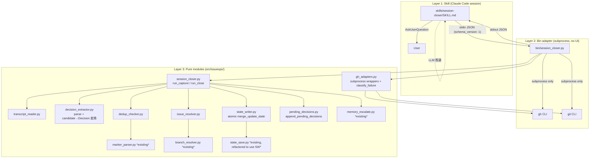
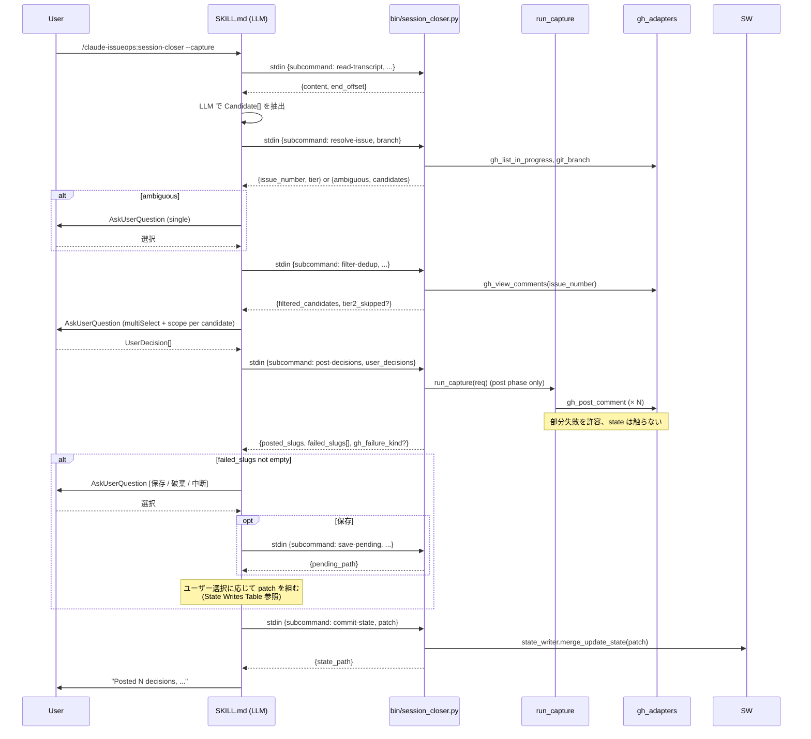
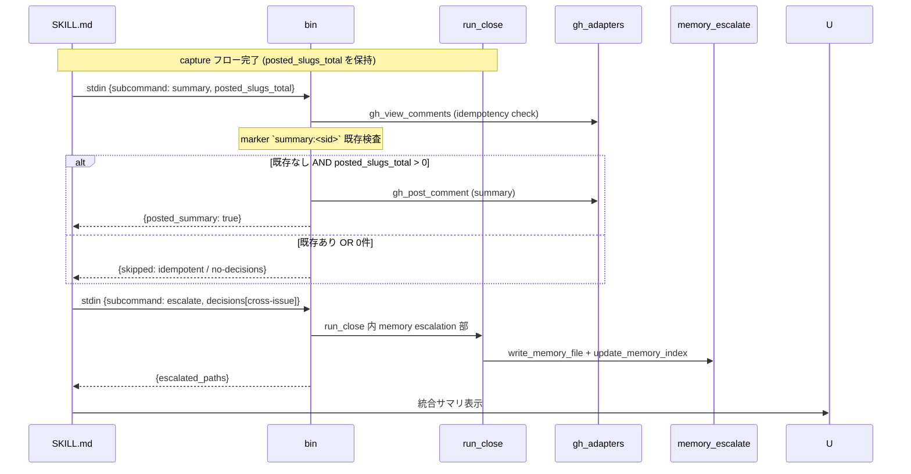
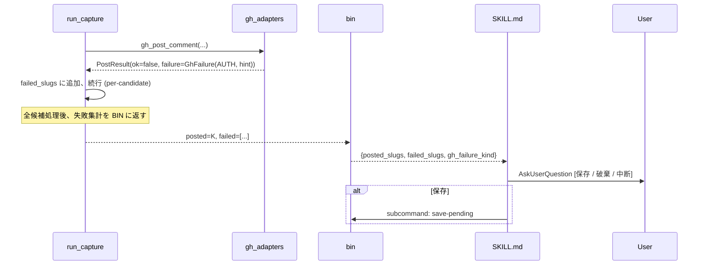

# Design Document — session-closer skill

## Overview

`session-closer` は、Phase 1 Requirements を満たす **「skill (LLM prompt + AskUserQuestion + orchestration) ↔ bin adapter (stdin JSON contract) ↔ pure modules」** の三層構造で実装する。既存の hook (PreCompact / UserPromptSubmit / SessionEnd) と同一の bin adapter pattern に揃え、テスト可能性とハーネス互換性を担保する。

LLM 推論および `AskUserQuestion` 経由のユーザー対話は **すべて SKILL.md (Claude Code セッション内) が責務を持つ**。Python 側は対話に一切関与せず、入力 JSON (候補 / ユーザー選択結果) を stdin で受け取り、出力 JSON (フィルタ済候補 / 投稿結果 / state 更新サマリ) を stdout に返す。これにより、ユニットテストはサブプロセスや MCP に依存せず駆動できる。

本 Design は Requirements の R-1 〜 R-10 すべてを網羅する。トレーサビリティは「Components and Interfaces」セクションで Requirement 番号を明示する。

## Steering Document Alignment

本プロジェクトには `.spec-workflow/steering/` の steering ドキュメントは未配置。代わりに以下を参照基盤とする:

- **CONTRIBUTING.md**: ブランチ命名 (`feat/<n>-<slug>`)、1 issue = 1 commit、no-ff merge、Decision marker protocol
- **既存の bin adapter pattern**: `bin/precompact_hook.py` をリファレンスとし、`(stdin payload → 引数の DI → run_* 関数 → exit 0)` の流れを踏襲
- **Pure module convention**: `src/issueops/<module>.py` は I/O を持たず、ファクトリー関数 `run_*` で副作用を依存性注入で受け取る
- **Memory file convention**: `~/.claude/projects/<encoded>/memory/` 配下、`reference_<slug>.md` の slug-identity ベース

## Code Reuse Analysis

### Existing Components to Leverage

| 既存モジュール | 活用方法 |
|----------------|----------|
| `src/issueops/marker_parser.py` `parse_decisions(text)` | R-5 Tier 2 dedup と R-2 summary idempotency で、Issue 既存コメントから既出 marker を検出する |
| `src/issueops/branch_resolver.py` `extract_issue_number / resolve_current_issue` | R-6 Tier 2 (branch fallback) および Tier 1 ↔ branch hint の交差確定で利用 |
| `src/issueops/memory_escalate.py` `render_reference_memory / write_memory_file / update_memory_index` | R-8 cross-issue 昇格でそのまま呼ぶ |
| `src/issueops/state_save.py` `state_file_path / STATE_SCHEMA_VERSION` | R-7 で state file path 検証を流用 |
| `bin/precompact_hook.py` の subprocess wrapper パターン | bin adapter の構造リファレンス。本機能では subprocess wrapper を **`gh_adapters.py` に集約** する (改善推奨 #4) |

### state_save の atomic write 化 (本 Phase の追加スコープ)

NFR Reliability で要求する atomic write を session-closer 単独で導入しても、共有 state file への書き込みパスのうち PreCompact (`state_save.save_pending_restore`) と SessionEnd (`session_end.run_session_end`) が非 atomic のままだと race の可能性が残る。本 Phase では:

- 新設 `state_writer.merge_update_state` を **すべての state file 書き込みパスの単一窓口** とする
- 既存 `state_save.save_pending_restore` / `session_end` の書き込みを `state_writer` 経由に切り替える小規模 refactor を Tasks に含める
- 既存テスト (89 件 green) は API 互換を維持して破壊しない

### Integration Points

- **GitHub Issue comments (`gh issue view --json comments` / `gh issue comment`)**: Decision 投稿と Tier 2 dedup の双方で利用。書き込みは argv 配列のみ、shell interpolation 禁止 (NFR Security)
- **Claude memory directory (`~/.claude/projects/<encoded>/memory/`)**: cross-issue scope 昇格先
- **Session-state file (`${CLAUDE_PROJECT_DIR}/session-state/<sid>.json`)**: 4 hook + skill の共有領域。`state_writer` 経由で merge update + atomic write

## Architecture



### Modular Design Principles

- **Single File Responsibility**: `transcript_reader` は読み込みのみ、`decision_extractor` は parse + 変換のみ、`dedup_checker` は除外判定のみ、`gh_adapters` は subprocess + 失敗分類のみ
- **Component Isolation**: skill 側 (LLM + 対話) と Python 側 (構造化処理) を **stdin/stdout JSON** で完全疎結合。LLM 出力フォーマットを契約として扱う
- **Service Layer Separation**: skill = presentation、bin = adapter、pure modules = domain。データアクセス (gh / git / file I/O) は bin と `gh_adapters` に集約
- **No UI in Python**: AskUserQuestion 呼び出しは Python から不可能 (Claude Code セッション内からしか叩けない)。Python は「対話結果を入力 JSON で受け取り、結果を出力 JSON で返す」純粋関数として設計

## Skill ↔ bin Contract (stdin/stdout JSON)

`bin/session_closer.py` は subcommand を持つが、**全データは stdin の JSON で受け渡す** (argv での大きなペイロード渡しを禁止、改善推奨 #1)。

### Contract schema (`schema_version: 1`)

```jsonc
// bin への入力 (stdin)
{
  "schema_version": 1,
  "subcommand": "read-transcript" | "resolve-issue" | "filter-dedup" | "post-decisions" | "commit-state" | "summary" | "escalate" | "save-pending",
  "session_id": "...",
  "project_dir": "/abs/path",
  // 各 subcommand 固有のフィールド
}

// bin からの出力 (stdout)
{
  "schema_version": 1,
  "ok": true,
  "result": { ... },           // subcommand 固有
  "warnings": [ "..." ]
}
// もしくは失敗時
{
  "schema_version": 1,
  "ok": false,
  "error": {
    "kind": "transcript-missing" | "issue-resolution" | "gh-failure" | "extractor-parse" | "internal",
    "message": "...",
    "gh_failure_kind": "auth" | "network" | "rate-limit" | "unknown",  // gh-failure 時のみ
    "hint": "gh auth status を実行してください"                         // auth 時のみ
  }
}
```

skill (SKILL.md) はこの schema を読み書きするテンプレートを内蔵する。`schema_version` の不一致を検出したら明示エラーで止める。

### Subcommand 一覧

| subcommand | input fields | output fields | Maps to |
|------------|--------------|---------------|---------|
| `read-transcript` | `transcript_path`, `offset` | `content`, `end_offset` | R-3.1, R-3.4 |
| `resolve-issue` | `branch`, `branch_pattern?` | `issue_number`, `tier`, `ambiguous_candidates?` | R-6 |
| `filter-dedup` | `issue_number`, `candidates`, `captured_slugs` | `filtered_candidates`, `tier2_skipped` (gh 失敗時) | R-5 |
| `post-decisions` | `issue_number`, `user_decisions` | `posted_slugs[]`, `failed_slugs[]`, `gh_failure_kind?`, `gh_hint?` | R-1.3 (投稿のみ、state 更新なし), R-9.1, R-9.2 |
| `commit-state` | `patch: {skill_ran_at, last_processed_offset?, captured_slugs?}` | `state_path` | R-1.4, R-1.5, R-7 (state 更新の単一窓口) |
| `summary` | `issue_number`, `captured_slugs_total` | `posted_summary` or `skipped: idempotent / no-decisions` | R-2.2, R-2.3 |
| `escalate` | `decisions[]`, `memory_dir` | `escalated_paths` | R-8 |
| `save-pending` | `issue_number`, `decisions[]` | `pending_path` | R-9.4 |

> **設計判断 (Codex 再レビュー対応)**: `post-decisions` と `commit-state` を分離した。理由: post 後にユーザー対話 (R-9 の 3 択) を挟む可能性があり、その選択結果次第で state 更新内容が変わる (`last_processed_offset` を更新するかしないか等、State Writes Table 参照)。一括 subcommand にすると abort 選択時の設計と矛盾する。SKILL.md が「post → 必要なら AskUserQuestion → commit-state with appropriate patch」の順で呼ぶことで、ユーザー選択を反映した state 更新が保証される。

### SKILL.md オーケストレーションのステップ (R-10)

1. 引数 (`--capture` 有無) からモードを決定
2. `read-transcript` → LLM プロンプトで Decision 候補を JSON 抽出 (`Candidate[]`)
3. `resolve-issue` で対象 Issue 番号を取得。`ambiguous` 応答のときは AskUserQuestion で選ばせ、`--issue-number-override` を加えて再投入
4. `filter-dedup` で Tier 1+2 dedup
5. AskUserQuestion (multiSelect) で承認 + scope 選択 → `UserDecision[]` を構築
6. `post-decisions` で gh 投稿のみを実行 (state は触らない) → `posted_slugs[]` と `failed_slugs[]` を取得
7. 投稿失敗があれば AskUserQuestion で 3 択 (保存 / 破棄 / 中断)
   - 保存: `save-pending` を呼ぶ
   - その後、ユーザー選択に応じた `patch` (State Writes Table 参照) を組み立て `commit-state` を呼ぶ
8. 投稿失敗がなければ全成功用 patch で `commit-state` を呼ぶ
9. close モードならさらに `summary` および `escalate` を呼ぶ
10. 最終 1 行サマリを stdout 出力

## Components and Interfaces

### Component 1: `src/issueops/session_closer.py` (orchestrator) — R-1, R-2, R-9

- **Purpose**: capture / close 両モードのトップレベル orchestration。**ユーザー対話を含まない**。SKILL.md がすでに対話を完了させた結果 (`UserDecision[]`) を受け取る。
- **Public API**:
  ```python
  @dataclass(frozen=True)
  class CaptureRequest:
      project_dir: Path
      session_id: str
      issue_number: int
      user_decisions: list[UserDecision]      # SKILL.md で承認 + scope 選択済
      transcript_end_offset: int               # read-transcript 時に取得した値
      gh_post_fn: Callable[[int, str], PostResult]   # gh_adapters 注入
      now: datetime | None = None

  def run_capture(req: CaptureRequest) -> CaptureResult: ...
  def run_close(req: CloseRequest) -> CloseResult: ...
  ```
- **Dependencies**: `decision_extractor` (型として `UserDecision` 参照), `state_writer`, `pending_decisions`, `memory_escalate`
- **Maps to Requirements**: R-1, R-2, R-7 (state writer 経由), R-9 (graceful)

### Component 2: `src/issueops/transcript_reader.py` — R-3.1, R-3.4

```python
@dataclass(frozen=True)
class TranscriptSlice:
    content: str
    end_offset: int

def read_transcript_since(transcript_path: Path, *, offset: int = 0) -> TranscriptSlice: ...
```

`FileNotFoundError` / `OSError` は上位伝播。

### Component 3: `src/issueops/decision_extractor.py` — R-3.2, R-3.3, 致命的 #2 対応

```python
@dataclass(frozen=True)
class Candidate:
    slug: str
    what: str
    why: str
    alternatives: str
    consequences: str
    scope_hint: Literal["issue", "cross-issue"]   # LLM 推定値 (確定値ではない)

@dataclass(frozen=True)
class UserDecision:
    """SKILL.md でユーザー承認 + scope 選択完了後・投稿前。"""
    candidate: Candidate
    final_scope: Literal["issue", "cross-issue"]   # ユーザーが決めた最終 scope (R-3.5)

@dataclass(frozen=True)
class PostedDecision:
    """投稿成功後。"""
    user_decision: UserDecision
    comment_url: str | None        # gh issue comment の URL (None なら local save)

def parse_candidates_json(text: str) -> list[Candidate]:
    """LLM 出力 JSON を Candidate[] に変換。
    - slug が kebab-case でない / 必須フィールド空 → 破棄
    - JSON parse 失敗 → ValueError 上位伝播 (orchestrator が abort)
    """

def candidate_to_decision(candidate: Candidate) -> Decision:
    """memory_escalate.write_memory_file / 投稿テキスト生成のために
    既存 marker_parser.Decision に変換する単純コンバータ。
    scope は Decision 側に持たない (Decision は marker frozen 仕様)。
    """
    return Decision(
        slug=candidate.slug,
        what=candidate.what,
        why=candidate.why,
        alternatives=candidate.alternatives,
        consequences=candidate.consequences,
    )
```

### Component 4: `src/issueops/dedup_checker.py` — R-5

```python
def filter_local(candidates: list[Candidate], *, captured_slugs: list[str]) -> list[Candidate]: ...

def filter_remote(candidates: list[Candidate], *, existing_decisions: list[Decision]) -> list[Candidate]: ...
```

`marker_parser.parse_decisions` の呼び出しは orchestrator 側、結果のみを `filter_remote` に注入してテスト分離。

### Component 5: `src/issueops/issue_resolver.py` — R-6

改善推奨 #3 対応の状態遷移表:

| Tier 1 (label) | Tier 1 ∩ branch hint | Tier 2 (branch_resolver) | 結果 | 動作 |
|----------------|---------------------|--------------------------|------|------|
| 0 件 | -- | None | -- | `IssueResolutionError` |
| 0 件 | -- | 1 件 | 確定 | Tier 2 を採用 |
| 1 件 | -- | -- | 確定 | Tier 1 を採用 |
| 2 件以上 | 1 件一致 | -- | 確定 | 交差を採用 |
| 2 件以上 | 0 件 | 1 件 | 確定 | Tier 2 を採用 |
| 2 件以上 | 0 件 | None | 曖昧 | `AmbiguousResolution(candidates=tier1)` を返す → SKILL.md がユーザー選択 |
| 2 件以上 | 2 件以上 | -- | 曖昧 | 同上 |

```python
class IssueResolutionError(Exception): ...

@dataclass(frozen=True)
class AmbiguousResolution:
    candidates: list[int]    # SKILL.md で AskUserQuestion 用に提示する候補

def resolve_target_issue(
    *,
    branch: str,
    list_in_progress_fn: Callable[[], list[int]],
    branch_pattern: str = DEFAULT_BRANCH_PATTERN,
) -> int | AmbiguousResolution: ...
```

ユーザー選択分岐は SKILL.md に戻し、再 invocation で `--issue-number-override <n>` 等を受ける形 (Python は対話しない)。

### Component 6: `src/issueops/state_writer.py` — R-7, NFR Reliability, 致命的 #6 #7 対応

```python
def merge_update_state(
    *,
    project_dir: Path,
    session_id: str,
    patch: dict,
    now: datetime | None = None,
) -> Path:
    """`<file>.tmp` に書き込み → os.replace で atomic に置換。
    既存ファイルが破損していたら quarantine_corrupt で退避。
    list 値はマージせず置換 (caller が責任を持つ)。
    """

def quarantine_corrupt(target: Path, *, now: datetime | None = None) -> Path:
    """target を `<basename>.json.corrupt-<ISO8601 microsec>` にリネーム退避。
    マイクロ秒精度で同一秒内衝突を回避 (改善推奨 #5)。
    """
```

実装ポイント:
- `os.replace` を使用 (改善推奨 #6, 致命的 #6)。`os.rename` ではなく
- `<file>.tmp` を作る前にディレクトリ書込権限を確認、existing tmp は touch しない (致命的 #6: 並行 hook の tmp を破壊しない)
- `tmp` は target と同一ディレクトリに置く (cross-filesystem rename を回避)
- 既存 `state_save.save_pending_restore` / `session_end.run_session_end` をこの API に refactor (致命的 #7、Tasks で扱う)

### Component 7: `src/issueops/pending_decisions.py` — R-9.4, 致命的 #5 対応

```python
PENDING_SCHEMA_VERSION = 1

def pending_path(project_dir: Path, session_id: str) -> Path:
    """state_save.state_file_path と同様の検証 + `<sid>.pending-decisions.json` を返す。"""

def append_pending_decisions(
    *,
    project_dir: Path,
    session_id: str,
    issue_number: int,
    decisions: list[UserDecision],
    now: datetime | None = None,
) -> Path:
    """既存 pending ファイルがあれば読み、`decisions` を追記して atomic write。
    schema_version 不一致は ValueError 上位伝播。
    issue_number が既存と異なる場合は警告ログ + 同一ファイルに別エントリで追記
    (1 セッションが複数 issue に投稿することはないが defensive)。
    """
```

スキーマ:
```jsonc
{
  "schema_version": 1,
  "session_id": "...",
  "issue_number": 8,
  "entries": [
    {
      "saved_at": "ISO-8601",
      "decisions": [
        { "slug": "...", "what": "...", "why": "...",
          "alternatives": "...", "consequences": "...",
          "scope": "issue" }
      ]
    }
  ]
}
```

### Component 8: `src/issueops/gh_adapters.py` — R-9.1, R-9.2, 致命的 #1 + 改善推奨 #4 対応

`bin/precompact_hook.py` の subprocess wrapper をすべて寄せ、本機能で必要な write 系も追加する (subprocess wrapper の単一所有者にする)。

```python
class GhFailureKind(StrEnum):
    NETWORK = "network"
    AUTH = "auth"
    RATE_LIMIT = "rate-limit"
    UNKNOWN = "unknown"

@dataclass(frozen=True)
class GhFailure(Exception):
    kind: GhFailureKind
    stderr: str
    exit_code: int
    hint: str | None

@dataclass(frozen=True)
class PostResult:
    ok: bool
    comment_url: str | None
    failure: GhFailure | None

# subprocess wrappers (既存 bin から移管 + 新規)
def gh_view_comments(issue_number: int, *, cwd: Path) -> list[dict]: ...
def gh_post_comment(issue_number: int, body: str, *, cwd: Path) -> PostResult: ...
def gh_list_in_progress(*, cwd: Path) -> list[int]: ...
def git_branch(cwd: Path) -> str: ...
def classify_gh_failure(stderr: str, exit_code: int) -> GhFailure: ...
```

分類ルール (R-9.1):
- stderr に `authentication` / `auth status` / `401` → `AUTH` + hint 付与
- stderr に `rate limit` / `429` → `RATE_LIMIT`
- stderr に `Could not resolve host` / `connection refused` / `timeout` → `NETWORK`
- 他 → `UNKNOWN`

### Component 9: `bin/session_closer.py` (bin adapter)

- I/O のみ。stdin で JSON を受け、subcommand を dispatch、`run_*` または `gh_adapters` を呼んで結果を stdout JSON に書き出す
- 例外をキャッチして `{ok: false, error: {...}}` に変換
- subprocess wrapper は `gh_adapters` 経由 (重複しない)

### Component 10: `skills/session-closer/SKILL.md` — R-10

frontmatter (R-10.1):
```yaml
---
name: session-closer
description: |
  capture mode (--capture): Decision を抽出・確認・投稿、session 継続
  close mode (default):     capture + summary 投稿 + cross-issue scope の memory 昇格
triggers:
  - session closer
  - capture decisions
  - close session
  - session 終了
  - decisions まとめて
---
```

本文に LLM 抽出プロンプトと、上記「SKILL.md オーケストレーションのステップ」をハードコードする。

## Data Models

### `Candidate` / `UserDecision` / `PostedDecision`

→ Component 3 を参照。

### State file schema (拡張)

session-closer が書く新規フィールドは 3 つ。sibling fields (他 hook 所有) は破壊しない (R-7.1):

```jsonc
{
  "session_id": "...",
  "briefing_done": true,                  // UserPromptSubmit
  "pending_restore": { ... },             // PreCompact
  "last_summary_at": "...",               // SessionEnd

  // session-closer
  "skill_ran_at": "2026-04-25T05:30:00Z",
  "last_processed_offset": 12345,
  "captured_slugs": ["use-bin-adapter", "..."]
}
```

### `pending-decisions.json`

→ Component 7 を参照。

## State Writes Table (致命的 #4 + 改善推奨 #8 対応)

各シナリオで、どのフィールドが更新されるか / されないかを明示:

| シナリオ | `skill_ran_at` | `last_processed_offset` | `captured_slugs` | `pending-decisions.json` |
|----------|:--:|:--:|:--:|:--:|
| 全候補が成功投稿 | ✅ now | ✅ end_offset | ✅ append (成功 slug) | -- |
| 部分成功 (一部 gh fail → ユーザー: 保存) | ✅ now | ✅ end_offset | ✅ append (成功 slug のみ) | ✅ append (失敗 slug の payload) |
| 部分成功 (一部 gh fail → ユーザー: 破棄) | ✅ now | ✅ end_offset | ✅ append (成功 slug のみ) | -- |
| 部分成功 (一部 gh fail → ユーザー: 中断) | ✅ now | ❌ (中途半端な offset を残さない) | ✅ append (成功 slug) | -- |
| 全候補ユーザー却下 (R-4.3) | ✅ now | ❌ (再 invoke で同じ範囲を再読する余地を残す) | -- | -- |
| 候補 0 件で early exit (R-1.2) | ✅ now | ✅ end_offset | -- | -- |
| transcript missing で abort (R-3.4) | ❌ | ❌ | ❌ | -- |
| Issue 解決失敗で abort (R-6.5) | ✅ now (副作用なしを示すため) | ❌ | ❌ | -- |
| extractor JSON parse 失敗 | ❌ | ❌ | ❌ | -- |
| SIGINT 中断 (atomic write 前) | -- | -- | -- | -- (state file は前回値を保持) |

> 設計判断: `skill_ran_at` は「skill が起動して何らかの処理に入った」事実を残すため、Issue 解決失敗時も書き込む (SessionEnd hook の skip 判定の一貫性のため)。一方 transcript 不在は skill が機能できる前提を満たしていないため、何も書かない。

## Sequence Diagrams

### capture モード (R-1)



### close モードの追加部分 (R-2, R-8)

capture モードのフロー終了後に走る:



矢印名は **呼び出し主体 → 委譲先** で統一 (Codex 改善推奨 #7 対応)。`bin → memory_escalate` は orchestrator 経由なので必ず `bin → ORC → ME` の二段。

### gh 失敗時 (R-9)

`post-decisions` の中で発生し得るすべての gh 失敗が同じ AskUserQuestion 分岐に合流する (commit-state は別途呼ばれる):



## Error Handling

### Error Scenarios

1. **transcript ファイル欠如 (R-3.4)**
   - **Handling**: `read-transcript` が `FileNotFoundError` をキャッチ → `{ok: false, error: {kind: "transcript-missing"}}`
   - **State**: 何も書かない (Table 参照)
   - **User Impact**: 「transcript が見つかりません。CLAUDE_PROJECT_DIR と session_id を確認してください」

2. **state file 破損 (R-7.4)**
   - **Handling**: `state_writer` 内で `quarantine_corrupt` → 警告 stderr → 新規 patch のみで再生成
   - **State**: 退避ファイル + 新規 state file
   - **User Impact**: 警告だけ、skill は継続

3. **`gh` 失敗 (R-9.1〜R-9.6)**
   - **Handling**: `gh_adapters.classify_gh_failure` で 4 種に分類 → AUTH なら hint 付与 → orchestrator が PostResult に格納 → bin が JSON で SKILL.md に返却 → SKILL.md が AskUserQuestion で 3 択
   - **State**: ユーザー選択により Table 参照
   - **User Impact**: 失敗種別 + hint 表示、3 択提示

4. **対象 Issue 不確定 (R-6.5)**
   - **Handling**: `IssueResolutionError` → bin が `{kind: "issue-resolution"}` を返す
   - **State**: `skill_ran_at` のみ
   - **User Impact**: 「対象 Issue を確定できませんでした」

5. **JSON 抽出フォーマット異常**
   - **Handling**: `parse_candidates_json` の `ValueError` → `{kind: "extractor-parse"}`
   - **State**: 何も書かない
   - **User Impact**: 「LLM 抽出結果の JSON が不正です」+ 再 invoke 案内

6. **SIGINT (Ctrl+C) 中断**
   - **Handling**: `state_writer.merge_update_state` は atomic なので、書き込み中に中断されても target は前回値を保持 (`.tmp` のみ残る → 次回 `merge_update_state` 起動時に削除しない、`os.replace` で上書きされる)
   - **State**: 中断時刻による (Table 参照)
   - **User Impact**: 安全に再 invoke 可能

7. **memory file 書き込み失敗 (R-8.4)**
   - **Handling**: `memory_escalate.write_memory_file` の例外をキャッチ、`{warnings: ["memory escalation failed for slug X"]}` に追加
   - **Issue コメントはロールバックしない**
   - **User Impact**: 警告 + 手動 escalation 案内

## Atomic Write Pattern (NFR Reliability + 致命的 #6 #7)

```python
# src/issueops/state_writer.py (擬似コード)
def merge_update_state(*, project_dir, session_id, patch, now=None):
    target = state_save.state_file_path(project_dir, session_id)
    target.parent.mkdir(parents=True, exist_ok=True)

    # Read existing or quarantine if corrupt
    existing: dict = {}
    if target.exists():
        try:
            text = target.read_text()
            data = json.loads(text)
            existing = data if isinstance(data, dict) else {}
        except json.JSONDecodeError:
            quarantine_corrupt(target, now=now)   # rename target → .corrupt-...
            existing = {}

    merged = {**existing, "session_id": session_id, **patch}

    # Atomic write: 同一 dir に tmp → os.replace
    # tmp 名は「pid + monotonic_ns + uuid4」で並行プロセス／同一プロセス内再入の双方に対して衝突しない
    suffix = f"{os.getpid()}.{time.monotonic_ns()}.{uuid.uuid4().hex[:8]}"
    tmp = target.with_name(f"{target.name}.tmp.{suffix}")
    tmp.write_text(json.dumps(merged, indent=2, ensure_ascii=False))
    os.replace(tmp, target)
    return target


def quarantine_corrupt(target: Path, *, now=None):
    ts = (now or datetime.now(timezone.utc)).strftime("%Y%m%dT%H%M%S.%f")
    quarantine = target.with_name(f"{target.name}.corrupt-{ts}")
    target.rename(quarantine)
    return quarantine
```

要点:
- `os.replace` は POSIX/Windows 双方で atomic (改善推奨 #6)
- tmp 名は **pid + monotonic_ns + uuid4** で並行プロセス・同一プロセス内再入 (skill の二度叩き / async ハンドラ) どちらに対しても衝突しない (致命的 #6 + 再レビュー新規改善推奨 #1)
- マイクロ秒精度の quarantine で同一秒内衝突を回避 (改善推奨 #5)
- 同一ディレクトリ内 rename なので cross-filesystem 問題なし

## Glossary 補完 (Codex 軽微 #1)

- **`scope_hint`** (Candidate のフィールド): LLM が抽出時に推定した scope。最終確定前。
- **`final_scope`** (UserDecision のフィールド): ユーザーが AskUserQuestion で確定した scope。memory escalation 判定はこの値で行う。
- **Skill ↔ bin contract**: stdin/stdout JSON で `schema_version` を持つ通信プロトコル。SKILL.md と `bin/session_closer.py` 双方で検証する。

これらは Requirements 側の Glossary にも追記する (Phase 1 既承認のため、Tasks フェーズで小修正として組み込む)。

## Testing Strategy

詳細は次フェーズの Test Design で記述。本セクションは方針のみ。

### Unit Testing
- 7 つの新規モジュール (`session_closer`, `transcript_reader`, `decision_extractor`, `dedup_checker`, `issue_resolver`, `state_writer`, `pending_decisions`, `gh_adapters`) を pure module として単体テスト
- DI を活用、`gh` / `git` は callable のスタブ

### Integration Testing
- `run_capture / run_close` を end-to-end (subprocess なし、callable 注入) でテスト
- シナリオ:
  - 全成功
  - 部分失敗 (gh fail) × ユーザー選択 3 択 (保存 / 破棄 / 中断) の各分岐で state writes table と整合
  - 全候補却下 (R-4.3)
  - Tier 2 dedup 発火
  - `pending-decisions.json` 既存ファイルへの append (新規セッションで append される)
  - **`pending-decisions.json` の `issue_number` 不一致シナリオ** (1 セッションが複数 issue に投稿することは想定外だが defensive な entries 追加が動くこと、Codex 軽微 #5 残課題対応)
- state_save と state_writer の互換テスト (refactor 後も既存テスト 89 件 green)
- `post-decisions` と `commit-state` を分離した結果として、`commit-state` を呼ばずに skill が落ちた場合に state file が前回値を保持していること (atomic write の保証検証)

### End-to-End Testing
- bin adapter は subprocess を実起動するため、CI では skip。代わりに **Claude Code セッション内で Claude (AI) が実行する verification 手順** として `VERIFICATION.md` を整備する
- skill (SKILL.md) のオーケストレーションは Claude Code セッション内からしか起動できないが、その実行主体は Claude 自身であり、人間ユーザーが手で叩く前提ではない
- AskUserQuestion 経由のユーザー対話部分は `verification-fixtures/<v-id>.json` をフィクスチャとして注入できるよう実装する (skill 起動時 `CLAUDE_ISSUEOPS_VERIFICATION_FIXTURE` 環境変数があれば fixture を読み AskUserQuestion を bypass する)。これにより L3 verification も Claude が一気通貫で自動実行できる
- 詳細は Test Design phase を参照
